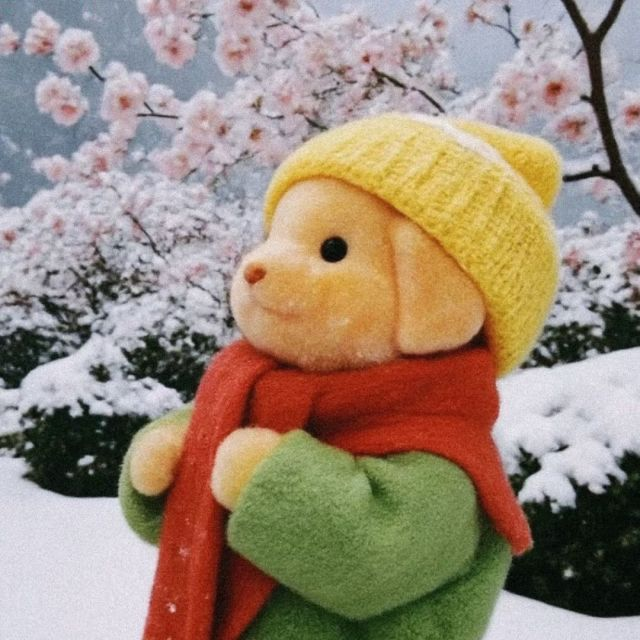

# 🎈 快乐是什么？！

小时候的快乐是一块糖、一张贴纸、一颗跳跳糖在舌尖炸开的那一瞬间；  
长大后的快乐，好像越来越难被定义，变得轻盈又遥远，像春天风里的蒲公英。

---

## 🌼 或许快乐是一种“刚刚好”

- 是刚好看到夕阳时，那一缕洒在窗边的橘光；
- 是在想放弃时，又刚好有人拍拍你说「你已经做得很棒了」；
- 是偶然间翻到很久前写下的一句话，你还记得那时的自己在期待什么。

---

## 💭 有时候快乐也藏在“不快乐”中

快乐不是永远的情绪高涨，它也许只是你经历低谷后依然愿意抬头看一眼天空。  
是你在忙碌和疲惫之间，依然给自己泡了一杯热茶，哪怕只是停下来坐一小会儿。

---

## 📓 写在博客的第一篇

开这个博客，不是为了追赶谁，也不是要成为多么“专业”的写作者，  
只是希望在这个叫做互联网上的浮岛，留一块小小的自留地。

这里会记录一些技术，也会记录一些生活。  
不赶路了，开始好好看看路，慢慢写点字。

---

> 如果你正在读这篇文章，那也许我们已经在某个想法上悄悄碰面了。👋

---

  
  
愿你今天也有一点点微小但真实的快乐 🌸

