## 0. 2025.03.15

**论文题目：**xNIDS: Explaining Deep Learning-based Network Intrusion Detection Systems for Active Intrusion Responses

*xNIDS：解释用于主动入侵响应的DL-NIDS*

**发表时间：**2023

**发表期刊/会议：**32nd USENIX Security Symposium (USENIX Security 23)

**笔记作者：**Wei F, Li H, Zhao Z, et al.

### 1.   内容简介（简要概括文章，不可以直接翻译摘要）

解释生成的过程是指在XNIDS框架中，如何从DL-NIDS的检测结果中提取出重要的特征，并基于这些特征生成可操作的防御规则。以下是解释生成过程的具体步骤：

1. 近似历史输入

- **目的**：找到对当前检测结果有影响的一小部分历史输入样本。
- **方法**：
  - 初始设置一个较小的l值（如1），检查使用这l个历史输入样本得到的检测结果与使用全部历史输入样本得到的检测结果之间的偏差是否小于设定的阈值δ。
  - 如果偏差大于或等于δ，则将l值翻倍；如果偏差小于δ，则将l值减半。重复此过程直到满足终止条件（如偏差δ或更新次数U）。
  - 从确定的l个历史输入样本中，通过主机过滤和协议过滤去除不相关的输入样本，得到最终用于解释的m个历史输入样本X′t,m。

2. 围绕历史输入进行采样

- **目的**：生成用于解释的合成样本，以更好地理解检测结果。
- **方法**：
  - 使用加权随机采样（WRS）策略，根据历史输入样本的到达顺序分配权重，较新的历史输入样本具有更高的权重。
  - 生成合成样本Zt,m，这些样本在历史输入样本的邻域内，且特征值的选择基于权重分布。

3. 捕获特征依赖

- **目的**：识别和利用结构化数据中特征之间的复杂依赖关系。
- **方法**：
  - 将输入样本的特征根据其相关性划分为多个组，每组内的特征具有相似的语义或功能。
  - 应用稀疏组套索（sparse group lasso）方法，在组级别和特征级别同时实现稀疏性，选择对检测结果贡献最大的特征组和特征。

4. 整合成解释模型

- **目的**：将上述步骤整合到一个线性模型中，以生成最终的解释结果。
- **方法**：
  - 建立一个线性模型g(·)，该模型近似于DL-NIDS的检测函数f(·)。
  - 通过最小化损失函数（衡量模型拟合度）和稀疏性约束（鼓励选择少量重要特征），确定模型的参数β。
  - 解释结果e由参数β决定，包含重要的特征及其权重，这些权重表示特征对检测结果的贡献程度。

5. 生成防御规则

- **目的**：基于解释结果生成可操作的防御规则，以主动响应检测到的入侵。
- **方法**：
  - 分析解释结果中的重要特征，确定防御规则的范围（如每流规则、每主机规则或多主机规则）。
  - 考虑安全约束（如白名单和封锁策略），确保防御规则的适用性和有效性。
  - 将统一防御规则转化为具体防御工具（如OpenFlow、iptables、Pfsense、Squid）的规则格式，以便在网络环境中实际部署。

通过以上步骤，XNIDS框架能够从DL-NIDS的检测结果中提取出有意义的解释，并生成相应的防御规则，从而提高网络入侵检测系统的可解释性和实用性。

评估结果表明，XNIDS在保真度、稀疏度、完整性和稳定性（fidelity, sparsity, completeness, and stability）方面优于以前的解释方法，还能有效生成实用的防御规则，帮助理解DL-NIDS行为，并排除检测错误。

### 2.   主要贡献（记录文章最核心的思路、方法）

`解决的问题`：[70]提出DL-NIDS的检测结果与可操作的解释性之间存在语义差距。

过去研究方法存在的问题：

①用于图像分类或恶意软件检测的DL模型基于单个输入样本(例如图像，一段二进制代码)做出决策。但DL-NIDS的输入是一个时间序列，根据当前样本和k个历史输入进行决策，现有解释方法不足以将历史样本考虑在内。 

②现有的解释方法不足以捕捉特征之间复杂的依赖关系，因为它们要么假设输入内的特征是独立的，要么假设相邻的特征具有相似的贡献。DL-NIDS输入样本的网络包头中的字段具有定义良好的含义和复杂的依赖关系。

③利用DL-NIDS的解释结果生成主动入侵响应防御规则的研究较少。

本文提出xNIDS，一个解释DL-NIDS并使用其解释结果生成可操作防御规则的新框架：

(1)围绕历史输入进行近似和采样，在原始预测附近找到少量历史输入并对每个历史输入进行采样；(2)利用特征组和稀疏组lasso，捕获结构化数据的特征依赖关系，以实现高保真的解释。（3）根据解释结果，xNIDS可以进一步生成可操作的防御规则。规则生成器通过引入防御规则范围、安全约束和统一的防御规则表示来生成准确实用的防御规则，从而实现主动入侵响应。

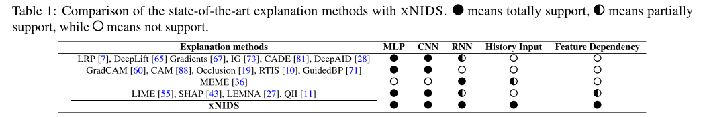

总结解释DL-NIDS面向的主要挑战如下：

Ch1: How to consider history inputs?(首先，如果只考虑固定数量的历史输入，可能会得到退化的解释，因为不同的攻击可能依赖于不同数量的输入(例如，DDoS, OSscan)，而考虑所有的历史输入也是不可行的。其次，当前输入可能比历史输入对DL-NIDS检测结果的影响更大，尤其是旧的输入。)

Ch2: How to capture complex feature dependencies in structured data?(IG/LRP/LIME假设特征独立导致解释保真度差；SHAP具有特征组设置，但假设每组特征贡献度相同[42,61]；LEMNA假设相邻特征贡献相似)

总结生成防御规则的主要挑战如下：

Ch3: How to balance precision and generalization for practical defense rule generation?(规则过于细粒度，导致过拟合和过多的防御规则；规则过于泛化，导致良性流量的误报)

Ch4: How to generate universally applicable defense rules for different defense tools?(例如，OpenFlow中的规则[50]和iptables中的规则[32]具有不同语法。)

(1)近似历史输入 (2)加权随机抽样合成历史输入附近的实例 (3)根据相关性划分特征组 (4)在组级和特征级上以稀疏的方式选择重要特征

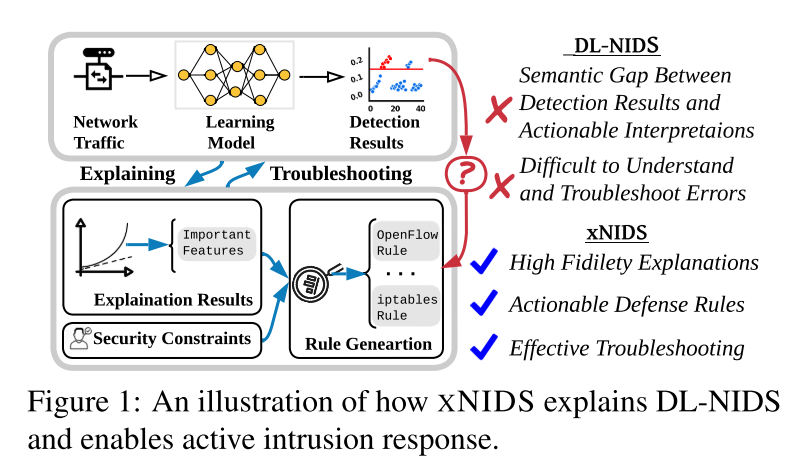

(1)逼近历史输入

DL-NIDS通常采用滑动窗口或RNN来捕获良性流量和异常流量的聚合信息，表示为yt=f(xt,Xt,k)。仅从xt或固定数量的历史输入中得出的解释结果是不够的，导致解释的保真度较低。同样，考虑所有的历史输入也是不够的。

本文：

step 1. 找一个小l，使得||f(xt,Xt,l)-f(xt,Xt,k)||<δ （if > δ, l=2l ; else l = l/2）两个终止条件：δ，决定了近似精度；更新的最大次数(U)

step 2. 从识别的l个历史输入中，删除一些历史输入并检查检测结果是否仍然满足δ要求来选择最相关的输入。(直观上来说，有可能在l范围内的一些历史输入是不相关的。) 输出为X't,m

为了去除不相关的输入，两个过滤器：(1)主机过滤器，它去除来自同一主机的输入；(2)协议过滤器，删除相同协议的输入。首先对l内的主机逐一应用主机过滤器；然后对l内的协议应用协议过滤器，如果主机或协议信息不可用，跳过步骤2。

(2)历史输入采样

DL-NIDS在决策时考虑历史输入；然而，新输入可能比旧输入对结果的影响更大。直觉是，旧输入的影响应该会减小;否则，DL-NIDS可能出现爆炸梯度和收敛不足。

本文：在历史输入附近进行不均匀采样

step 1. 为最新的历史输入分配更大的权重，以表明它们对检测结果的影响更显著。(D是一个衰减函数)

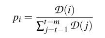

step 2. 通过WRS将合成的样本转向最新的历史输入。根据历史输入的到达顺序对其进行加权，因此最新历史输入的特征被选中的概率更高，而相同输入的特征被选中的概率相同。另外，如果历史输入和当前输入对检测结果有相似的影响，可以给历史输入分配恒定的权重，此时WRS将被简化为随机抽样。

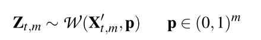

(3)捕获特征依赖关系

DL-NIDS通常采用基于关联的方法(如聚类)或领域知识来处理结构化数据的特征依赖关系，以获得更好的检测性能。

本文：为了捕获结构化数据的特征依赖关系来进行解释，首先根据它们的相关性将特征分成几组。对特征组应用稀疏组套索(sparse group lasso)来实现稀疏解释。

为了实现高保真度的解释，通过将输入的特征根据其相关性划分为几组来解决结构化数据中的特征依赖挑战。

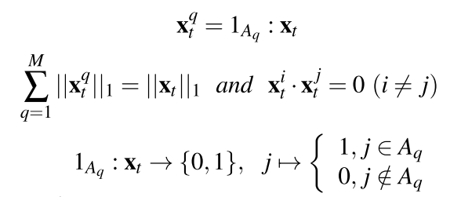

用M个指示函数来将xt划分为M组，每个特征必须只能出现在一个组中。考虑了以下三种情况：

- 目标DL-NIDS使用的分组策略是可用的，通常由领域知识确定。对xNIDS采用相同的分组策略;

- 有包含相关历史样本的数据集，但目标DL-NIDS使用的分组策略不明确。用聚类方法计算特征的相关性，创建指示函数;

- 分组策略和数据集不可用，xNIDS被迫将每个组的大小设置为1。此时，稀疏组lasso将被缩减为lasso。

稀疏组：为了实现稀疏解释，需要最小化φ(e)，即从输入中选择最相关的特征作为解释结果，同时省略那些对检测结果没有显著贡献的特征。

稀疏组Lasso (Sparse group lasso)是一种回归方法，它允许将预定义的特征组一起选择到模型中或从模型中选择出来，其中特定组的所有特征要么被包括在内，要么被排除在外。更重要的是，它具有组级和特征型稀疏性的预期效果。稀疏组lasso能够在预测相应的检测结果时找到重要的解释因素，其中每个解释因素可能由输入内的一组特征组成。同时，稀疏组lasso实现了组级和特征级的稀疏效果。

本文回归问题建模如下：

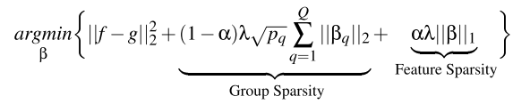

为了实现组级稀疏性，最小化∑||βq||2，即通过使||βq||2= 0来排除更多的组。为了实现特征级稀疏性，最小化||β||1，通过使||βi||1= 0来排除更多的特征。

(5)模型实现

近似适当的历史输入X't,m；结合衰减函数和加权随机抽样，对历史输入的抽样策略进行调整；根据线性逼近的概念，利用线性分量逼近DL-NIDS的局部决策边界。

具体来说，这里的关键思想是利用局部线性模型来近似yt=f(xt,Xt,k)周围的个体决策边界。

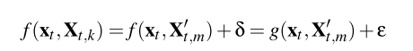

g()为局部近似方法，定义如下：

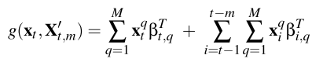

最后，将解释模型形式化为以下回归问题：

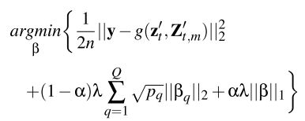

求解这个方程中的目标函数，稀疏组lasso需要重复两个循环：组级外循环和特征级内循环。组级外环循环检查组的系数是否为零向量。如果一个组的系数是非零向量，那么特征级内循环会修改向量内的每个参数。稀疏组lasso重复这两个循环，直到参数收敛。

(6)防御规则生成

在提取DL-NIDS用于做出特定决策的重要特征之后，xNIDS根据这些特征生成防御规则。

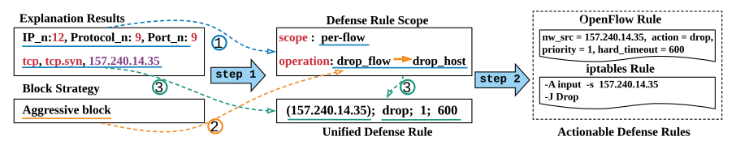

其关键思想是①通过分析解释结果来确定防御规则的范围，②修改有关块策略的操作，③通过用来自重要特征的值创建相应的实体来生成统一的防御规则。最后，xNIDS自动将统一的防御规则转换为可操作的防御规则(如OpenFlow规则和iptables规则)。

- 防御规则范围：引入防御规则范围来限制规则应该适用的范围。精度度量要求防御规则只影响恶意流量，而不影响良性流量。泛化度量则要求防御规则对攻击中涉及的所有恶意流量发出警报。
- 定义规则范围。防御规则的作用域可以在三个层次上定义：①Per-flow Scope。逐流防御规则只能影响特定流的网络数据包。例如，用于终止TCP连接的防御规则被认为是逐流防御规则。②Per-host Scope。单主机防御规则可以阻止来自同一主机的多个流量。例如，用于阻止bot的防御规则被认为是单主机防御规则。③Multi-hosts Scope。多主机防御规则可以阻断来自多个主机的多条流量。例如，
  用于阻止来自一组主机(例如僵尸网络)的SYN请求的防御规则被认为是多主机防御规则。
  分析解释结果。通过分析相应的解释来确定防御规则的适当范围。如表2所示，将统计信息定义为S，其中包含五个字段，IP_pool、IP_n、MAC_n、Port_n和Protocol_n。统计信息对于生成实用的防御规则至关重要。如果它不可用，则xNIDS不会生成防御规则。

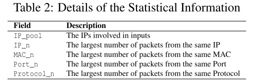

通过检查统计信息(S)中哪个字段值最大来决定单主机和多主机范围。例如，当协Protocol_n或Port_n的值最大时，表示异常流量属于同一协议，但不是来自单个主机。也就是说，很可能有多台主机参与了这次攻击。因此，防御规则应该具有多主机作用域。否则，如果异常流量来自同一主机，对应的防御规则应该具有单主机或单流量作用域。在这种情况下，如果重要特征包含多个协议或端口，即主机使用多个协议发起攻击，则防御规则具有单主机作用域，否则防御规则具有单流量作用域。

- 安全约束：在一个站点上运行良好的防御规则，在另一个站点上可能完全无法使用。对此，根据安全约束动态调整防御规则就显得尤为重要。

  为了使防御规则适应不同的网络环境，引入网络运营商可配置的安全约束。设计了两种机制，白名单和阻断策略，分别确保网络可用性和保持适当的阻断率。进入白名单的关键服务的网络流量不受其他防御规则的影响；网络运营者可以根据自己的需求和知识，为统一防御规则生成过程选择合适的阻断策略。进一步定义了三种主要选项：①被动拦截passive block。xNIDS只生成阻止恶意流的防御规则。这种策略的目标是尽量减少防御规则的影响;②自信阻断assertive block。网络运营者倾向于信任相应的DL-NIDS和xNIDS生成的规则;③进攻性阻断aggressive block。xNIDS倾向于通过直接阻止主机来阻止恶意活动。这种策略的目标是快速清除网络环境中的恶意主机。

- 统一防御规则：为支持使用不同规则语法的各种防御工具，引入统一的防御规则表示，作为解释和可操作防御规则之间的桥梁。

  每个统一防御规则包括四个主要组成部分，它描述了基于一组网络属性对网络流量子集执行的动作。①实体，一个目标(例如，一个连接)，防御动作在其中被应用；②动作，对实体的所有网络流量执行的特定防御操作；③优先级，当一个网络流量实例匹配多个统一的防御规则时，只应用优先级最高的规则（优先级组件(默认由增量顺序决定)可以显式指定从一组统一防御规则中解决潜在冲突的操作顺序）；④超时，专门用于控制防御规则的有效时间。

  - 实体：统一防御规则可以定义多种实体，网络流、连接、IP地址、网络前缀、二层MAC地址等。统一规则通过8元组来指定这些实体，并支持通配符作为元组元素。
  - 动作：统一防御规则使用一系列原始动作来指定如何对相应的网络流量进行操作。直观的动作是Drop和Allow，用于对来自匹配实体的数据包实施显式访问控制。Modify的目的是改变来自特定实体的数据包的属性(例如，dest IP)。Whitelist是一种预防方法，使实体不受任何其他防御规则的影响。这是一种确保目标网络可用性的预防性措施。
  - 生成统一防御规则：在相应的字段中填充来自防御规则范围和安全约束的重要特征的匹配值来创建实体。

为了将防御规则范围与防御动作关联起来，定义了两个基本操作：drop_flow和drop_host。对于per-flow规则，使用drop_flow操作阻止恶意流。对于per-host规则，使用drop_host操作阻止恶意主机。对于multi-host规则，使用drop_flow操作递归地阻止恶意流。

为了配合不同的阻断策略，分别修改操作：对于passive block，将drop_host操作修改为drop_flow操作。对于aggressive，将drop_flow操作修改为drop_host操作。而对于assertive block，保持操作不变。

最后，基于操作创建实体。例如，在使用drop_flow操作生成multi-host规则时，需要递归地创建流实体。为了防止规则冲突，将优先级设置为一个增量数字。同时，对于不同的部署环境，timeout参数是可配置的。

### 3.   实验结果（仅记录关键结果，重点在于对实验的分析）

xNIDS实现：逼近历史输入设置的搜索终止条件δ=1e−2，更新次数为10；历史输入附近的衰减函数为高斯函数；捕获特征依赖关系中，设置的稀疏组lasso的混合参数α= 0.05和调优参数λ= 0.2。使用Python包asgl实现xNIDS，使用网格搜索来调优参数以提高性能并测试参数的灵敏度。

四个最先进的DL-NIDS：①基于自编码器的Kitsune，及其发布的数据集 ②基于LSTM的Bot检测系统ODDS，使用CIC-DoS 2017数据集 ③RNN-IDS，NSL-KDD ④基于深度自编码器的AE-IDS，NSL-KDD

baseline：LIME SHAP LEMNA IG LRP

防御规则生成：xNIDS可以为iptables[32]、OpenFlow[50]、Pfsense[53]和Squid[72]等四种防御工具生成有效的防御规则，以防御各种攻击。xNIDS将统一的防御规则转换为具体的防御规则，然后通过以下步骤部署到不同的防御工具中。根据对象防御工具的具体语法，创建可操作的防御规则模板。在可操作防御规则模板中的相关字段中填充来自统一防御规则的适当值。生成的防御规则自动或手动部署到相应的防御工具中。

评估标准：[27,55,79]保真度、稀疏性、完整性、稳定性；实用性、准确性、效率

#### Evaluation of Explanation

(1)Fidelity:解释方法捕获有助于特定检测结果的重要特征的忠实程度，采用描述精度(Descriptive Accuracy, DA)，定义为DAk(x，f) = f(x|modify(k)).

modify(k)：①对于anomaly samples，将k个重要特征置0；②对于benign samples，将良性样本的top-k特征替换为最近异常样本的相应特征（因为将良性特征设置为零通常不会影响预测）

如果解释方法可以准确地选择良性样本的良性特征，那么用相应的异常特征替换这些特征可能会导致错误分类。

将这些样本输入到DL-NIDS并计算整个数据集的平均描述精度(ADA)。如果选择的重要特征与检测结果相关，那么保真度测试的ADA会显著降低。

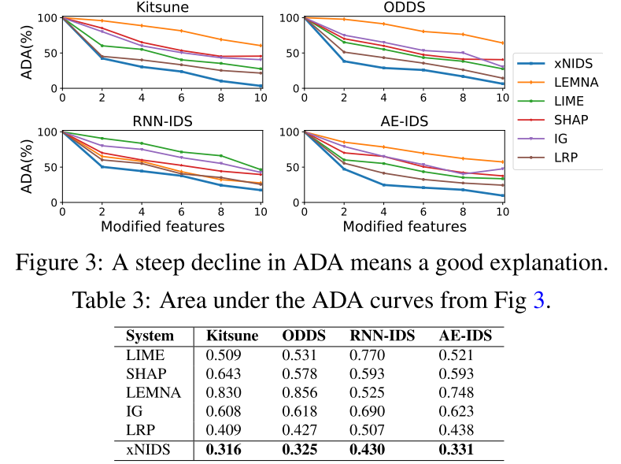

分析：在选择相关特征时，xNIDS通过稀疏组lasso捕获特性依赖项，而基线方法忽略了它们。实验证实了xNIDS在选择重要特征方面可以产生更忠实的解释结果。

(2)Sparsity：评估解释的稀疏性，所期望的解释方法应该选择有限数量的特征作为解释结果，使用Mass Around Zero (MAZ)。

由于重要分数β被缩放到[0,1]范围，将β拟合到半规范化直方图h，计算MAZ: MAZ(β) =∫(0-1)h(x)dx。如果解释方法可以将大多数特征赋值为零并实现稀疏解释，那么MAZ曲线的斜率接近于零，并且AUC很大。

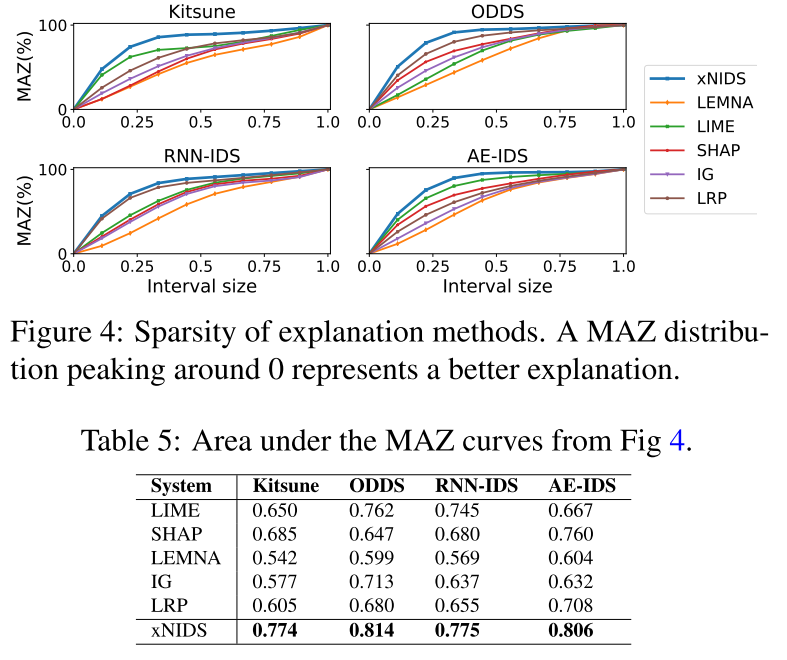

分析：xNIDS通过采用稀疏组lasso技术在组级和特征级都实现了稀疏效果，适合于解释DL-NIDS。

(3)Completeness：如果一个解释能够为所有可能的输入样本创建适当的结果，那么它就是完整的。Warnecke等人[79]认为，必须合成一小部分(5%)被检测为相反类别的样本，以实现完整性。

将良性特征替换为样本附近的恶意特征，可以有效地满足5%的要求。在评估考虑历史输入的完整性时，观察到在某些情况下，当前输入xt包含了解释所需的所有信息。因此，有可能从当前输入中获得非退化的解释。然而，如果忽略历史输入，很可能会得到其他情况的退化解释。此外，为异常样本创建非退化的解释更为关键。从网络运营商的角度来看，只需要在保持良性完整的情况下防止异常。直观地，通过计算异常样本的百分比来衡量历史输入的完整性，异常样本包含了足够的信息来进行非退化的解释。

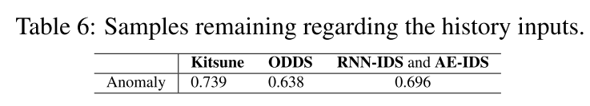

分析：至少26%的异常样本没有包含足够的信息来进行非退化的解释。这意味着，对于这些样本，仅凭当前输入样本无法得到完整的解释，需要结合历史输入来提供更全面的解释。xNIDS可以动态地近似历史输入，并且在完整性方面优于现有方法。

(4)Stability：期望的解释方法应该在多个测试中对相同的样本产生相似的结果。

为了检验解释的稳定性，计算了关于不同测试的相同输入的解释结果的前K个特征的交集大小。stability = 1/K||{top(β1) ∩ top(β2) ... ∩ top(βn)}||1，一个稳定的解释方法应该有一个接近1的稳定性评分。

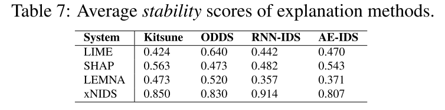

分析：xNIDS可以通过以下方式生成更稳定的解释，①利用特征组更可靠地合成样本;②通过给最新的输入分配更高的概率来集中样本。

(5)Sensitivity and Tuning of Hyper-Parameters：如果参数设置不同，XNIDS的性能将如何变化。使用网格搜索来找到理想集。

为每个参数设置范围:δ=[1e−4,1e−1]，U=[1,100]，α=[1e−2,1]，λ=[1e−2,1]

分析：如果δ太小，更新次数(U)太大，xNIDS将不够用，因为搜索空间将呈指数增长。将更新次数设置为10以高效地近似历史输入；对于历史输入周围的采样，高斯对所有实验都很有效；为了捕获特性依赖，遵循与目标DL-NIDS相同的组策略；对于稀疏组lasso，λ越大，解释就越稀疏，λ= 0.2在实验中达到了最好的综合性能。另外，在特征数量不断增加，分组信息不可用的情况下，稀疏组lasso组件将简化为lasso。

(6)Summary of Explanation Evaluation

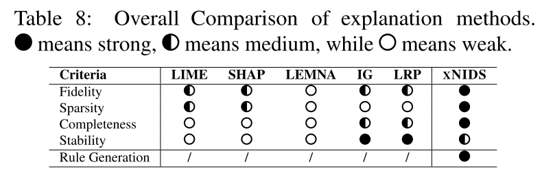

分析：总的来说，xNIDS具有最佳性能，因为它考虑了历史输入和特性依赖关系。

#### Evaluation of Rule Generation

(1)支持的防御工具

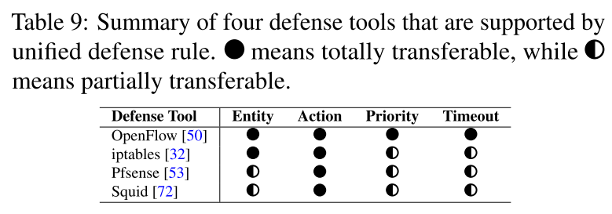

(2)涵盖的攻击

per-flow：以SYN DoS为例，一种简单的方法是阻止来自恶意主机的单向流。

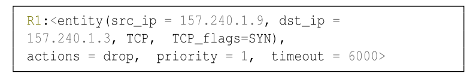

per-host：以OS扫描为例，统一防御规则会尽可能长时间地按照IP或MAC地址对受感染的设备进行拦截。

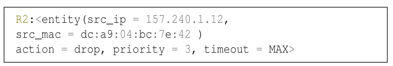

multi-hosts：以简单服务发现协议(Simple Service Discovery Protocol, SSDP)放大为例，。统一防御规则将阻断所有目的端口为1900的网络流量，同时允许良性主机使用此服务。缺省情况下，多主机作用域规则递归阻断来自恶意主机的SSDP流。但是，另一种方法是关闭SSDP端口，同时允许良性主机使用此服务。

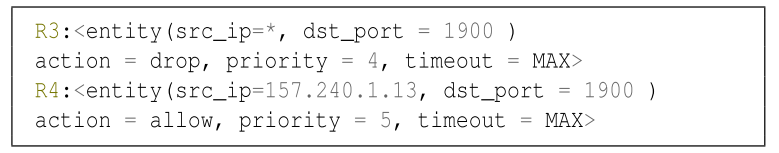

(3)延迟

解释延迟(Explanation Latency)。超过90%的解释延迟在600ms以下。这个延迟是由解释方法的速度和目标DL-NIDS决定的。
规则生成延迟。不同防御工具的规则生成时间是不同的。最大的延迟(35ms)是Reconnaissance攻击的OpenFlow规则。平均延迟约为25ms。

(4)对比工作：FIRMA[54]

XNIDS可以支持更多的防御工具，并生成不同作用域的防御规则。相比之下，FIRMA只支持两种防御工具，并生成每个主机的规则。此外，FIRMA需要离线分析签名生成，而XNIDS可以直接从DL-NIDS的检测结果解释中生成规则。

#### Troubleshooting and Active Responses

通过分析DL-NIDS背后的检测逻辑，本文还提出了在减少检测错误方面修补DL-NIDS的方法。

利用防御规则生成程序最大限度地减少检测错误的成本。例如，使用被动阻断策略来生成每流范围规则来阻断恶意TCP.SYN流量，同时保持良性的UDP流不变。这种方法的优点是不需要重新训练DL-NIDS，同时减少了运行时的错误。为了使DL-NIDS更具鲁棒性，需要有意地干扰流量。对于Unseen Benign，可以用增强后的数据对DL-NIDS进行再训练，从而降低FPR。

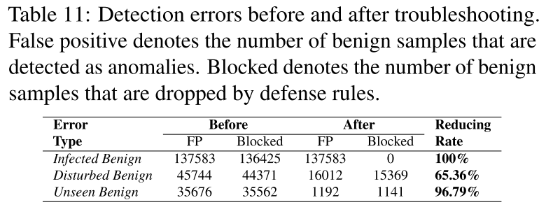

三种类型的误报：①Infected Benign，来自被感染主机的良性流量被误检测为异常;②Disturbed Benign，来自良性主机的扰动流量被误检测为异常;③Unseen Benign，未见过的良性流量被误认为异常，这是DL-NIDS最常见的错误。

主动响应展示了三种情况下XNIDS的阻塞率，并将其与基线方法FIRMA进行比较。

提升xNIDS的鲁棒性？

[86]认为，为了减轻这些对抗性攻击，需要提高目标深度学习模型及其耦合解释模型的鲁棒性。本文希望：(1)通过应用生成对抗网络(GAN)[26]来提高DL-NIDS的反业务能力，考虑到准确性和鲁棒性之间的权衡，创建一个大型数据集进行对抗训练；(2)通过解释器集合提高XNIDS的鲁棒性[86]。

如何提升自适应性？

能够自我调整以适应动态环境的完全自主系统更为可取。为了进一步解决这一问题，计划在xNIDS中采用强化学习(RL)的概念[48,75]，使其适应不同的网络环境。

如何实现Global Explanation？

对具有更有意义的高层次特征的人类可解释的解释存在额外的需求，计划在模块化层面上研究全局模型可解释性的概念[15,38]。通过全局解释，可以研究特征的高水平相关性，并检查DL-NIDS是否被学习到的工件[4]误导。

### 4.   写作技巧（文章在章节划分、遣词造句方面的特点）

1.各章节之间逻辑紧密，从问题的提出到方法的介绍，再到实验的验证和结果的分析，最后到实际应用和未来展望，形成了一个完整的论述链条。

2.在案例研究部分，通过具体的攻击场景（如SYN DoS、OS扫描、SSDP放大攻击等），详细展示了XNIDS的应用过程和效果，使理论与实践相结合，增强了文章的说服力。

### 5.   结论收获（总结自己通过本文学到的知识）

xNIDS框架的核心创新：

- **历史输入的近似与采样**：通过动态近似历史输入并进行加权随机采样，xNIDS能够更好地捕捉时间序列数据中的上下文信息。
- **特征依赖的捕获**：通过稀疏组lasso（sparse group lasso）方法，xNIDS能够识别和利用结构化数据中特征之间的复杂依赖关系，提高解释的准确性和稀疏性。

防御规则的生成与应用

- **防御规则的生成**：基于解释结果，XNIDS能够生成可操作的防御规则，支持多种网络防御工具（如OpenFlow、iptables等），实现主动入侵响应。
- **安全约束与策略**：通过引入安全约束和不同的封锁策略，XNIDS确保生成的防御规则既准确又适用于不同的网络环境。

研究的局限与未来展望

- **鲁棒性与适应性**：文章讨论了XNIDS在面对对抗攻击时的鲁棒性，并提出了改进的潜在方向。
- **全局解释与模块化解释**：文章指出了当前解释方法的局限性，并提出了未来研究的方向，如全局模型解释和模块级解释。