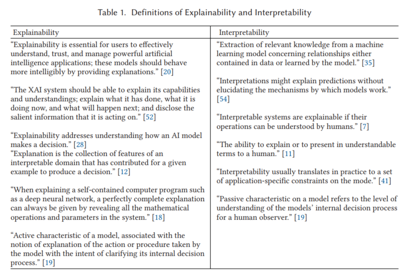
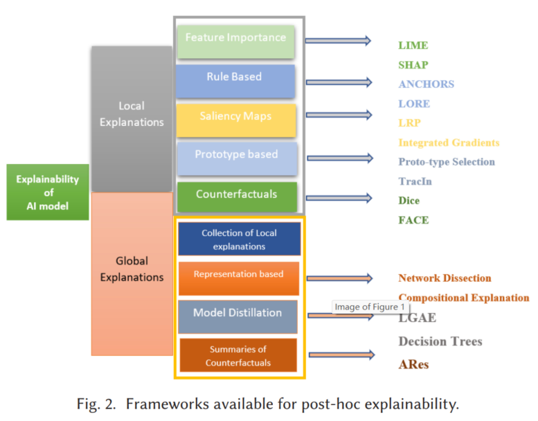

## 1. 2025.03.31

**论文题目：**Toward Trustworthy Artificial Intelligence (TAI) in the Context of Explainability and Robustness

*在可解释性和鲁棒性的背景下迈向值得信赖的人工智能（TAI）*

**发表时间：**2025.02

**发表期刊/会议：**ACM Computing Surveys

**笔记作者：**Chander B, John C, Warrier L, et al.

### 1.   内容简介

从创新的角度来看，人工智能（AI）已成为各类技术中一个显著的研究领域，并几乎扩展到现代人类生活的方方面面。然而，如今AI的发展具有不可预测性，其价值观与开发者的初衷不符，因此AI行为失控的风险持续增加。因此，关于AI的开发和部署是否有利于人类而非有害存在不确定性。此外，AI具有黑箱特性，这导致人们对系统如何运作缺乏理解，进而引发了相关担忧。基于以上讨论，可信赖AI对于AI在众多应用中的广泛采用至关重要，需要在系统设计阶段就重点关注AI系统的开发，使其符合人类的利益和需求。

不同类型的系统发展迅速，复杂且高效，有可能在各种应用中揭示深入、有价值的见解，但AI的唯一要求是，AI系统的采用将需要人类信任其输出值或决策[6]。基于AI的系统具有黑箱结构，这意味着输入模型的数据集和输出结果。随着世界向数字化迈进，人们必须了解技术和其工作方式，然后才能衡量它是否安全可靠。然而，在当前情况下，人们完全不信任AI的流程。信任的主要原因是信任由算法或模型完成的决策或问题解决[3,6]。

### 2.   主要贡献

根据各国顶级专家对AI系统的最新报告，可信赖的AI必须是符合伦理的、鲁棒的、确保环境福祉的，并且是合法的。上述特征是必要的，但不足以实现可信赖的AI系统。过去几年中，IBM的核心研究小组一直在研究各种技术，以确保基于AI的系统是公平、安全、合法、可解释、鲁棒的，并且与它们实际设计的社会价值观一致，AI应用将与其整个生命周期中的有效性一样合理和开放[9]。

本文与现有的“关于AI模型的可解释性和鲁棒性的综述论文”有以下不同之处。

- 本文主要关注检测可解释AI（XAI）和鲁棒性的新局限性，以及为政策制定者提供可能的解决方案。这包括寻找当前AI中鲁棒性与可解释性之间的可能联系。
- 本文提供了用于不同数据模态的可解释性和鲁棒性方法的大量介绍，并讨论了这些模型的必要特征。

### 3.   可信赖AI及其要求

从技术上讲，可信赖AI是一个定义AI的术语，该AI在精确、合法和道德信仰方面是鲁棒的。换句话说，它完全描述了AI的设计、意图、概念和结论，当在AI生命周期的每个阶段建立信任时，它将充分发挥其潜力，从基本提案到进展和有效定位。

1.Transparency  

`透明性`包括`可追溯性、可解释性和沟通`(traceability, explainability, and communication)。与AI系统相关的数据、数据集、系统以及所有相关的专业副本必须是透明的，因为任何AI系统的技能和边界都必须对参与者清晰可见。足够的透明性为AI系统带来了更有效的责任和适用性。

可追溯性引导了解可解释性。如果AI系统的数据可追溯性做得很好，那么解释决策的技术过程就变得容易，并且可以被人类理解和追踪[27,28]。

具有可解释性的AI系统为客户提供了如何做出特定决策的可理解解释，以及如何通过不同的方法改变这些决策。这意味着参与者能够在每次交易发生后理解黑箱工作步骤。

沟通在可信赖的AI系统中是告知人类参与者他们正在与AI系统互动。在这种沟通中，设计者必须关心AI系统的能力和限制，以及与基本人权相关的部分。

2.Technical Robustness and Safety  

在可信赖AI的背景下，`鲁棒性和安全性`包括`对攻击的弹性、安全性、故障转移计划以及一般安全性、精度和可重复性`(resilience to attack and security, a fallback plan, and general safety, precision, and reproducibility)。

与传统系统一样，可信赖的AI系统必须随时可用，并且同时产生一致认证的输出结果。众所周知，AI系统在执行过程中可能会产生错误结果，因此设计者必须构建有效的方法，以处理任何出现的问题和冲突。

设计的基于AI的系统必须变得鲁棒，即安全，能够处理异常情况，并且根据情况表现良好，并且在需要时能够进行可重复性。

对抗性威胁和攻击被视为另一个重要方面。这些类型的攻击可能会改变系统的行为，迫使系统做出各种错误的结论[33]。因此，提出的基于AI的系统应该是鲁棒的，并且如果可能的话，能够内部生成可能的预防方法，以尽量减少损害。任何领域的鲁棒性都表明所开发的系统必须包含针对风险的预防方法；系统必须始终如一地按计划执行，同时尽量减少意外损害。

在AI系统的背景下，准确性是指做出正确判断、预测和关键决策的能力。为此，AI系统应该是明确的，并且(valuation and evaluations)应远离错误的数据预测。

可重复性和可靠性在AI系统中与各种输入数据在各种条件下表现良好。确保AI系统的结果在某种程度上是可重复的，这意味着在重复条件下可以得到相同的结果。可重复性和可靠性对于检查AI系统至关重要，以防止未经授权的损害。

3.Accountability  

`问责制`包括`可审计性、最小化和报告负面影响、权衡和补救`(auditability, minimization, and reporting of negative impact, tradeoffs, and redress)。

问责制还与公平性和可解释性的原则相关。它确保AI系统的工作流程在系统部署之前展示了其结果的可靠性。设计者必须使其AI系统的可审计性，这意味着在需要时向人们提供必要的信息和业务阶段，包括知识产权。在这种背景下，所有评估的数据集以及内部和外部报告，包括基本权利和安全测量，都必须被记录下来。在部署AI系统之前，确保设计的模型可以最小化报告的错误，适当响应后果，并有助于可能的结果。

4.Privacy and Data Governance  

`隐私和数据治理`包括`尊重隐私、数据的质量和完整性以及数据的访问`(respect for privacy, quality and integrity of data, and access to data)。

一般来说，隐私是防止AI系统受到损害，并且隐私政策必须涵盖适合的数据治理，包括使用数据的质量和完整性。在这方面，提出的AI系统确保在AI系统生命周期中数据的安全性和完整性[2,42]。它遵循用户最初提供的数据以及用户在与AI系统互动时生成的关于用户的数据。

5.Fairness, Diversity, and Non discrimination  

`公平性、多样性和非歧视`包括`避免不公平偏见、无障碍性以及与人类参与者的通用设计`(the avoidance of unfair bias, accessibility, and universal design along with human participants)。

公平性与偏见密切相关，并经过测试和验证，以确定偏见是否符合正确设计的原则。可信赖的AI必须使用适当的数据进行训练，以做出公平的决策[9,10]。此外，它必须考虑技术、社会和人类偏见。AI系统从给定的数据中学习，如果数据包含现实世界的偏见，那么AI必须学习、检测并解决这些偏见，速度要快，规模要大。这意味着AI系统需要获得所需的日常场景，以帮助做出适当判断，这些判断在技术上是正确的，但在社会上是有争议的[22,23,31]。

多样性确保通过全面的设计过程为所有参与者提供平等的访问机会，这与公平性密切相关。在大多数情况下，AI系统中使用的数据集遭受数据不完整、错误、糟糕的治理模型以及历史和社会偏见的困扰。因此，数据集中持续存在的偏见导致意外的决策[46]。

具有用户友好设计的AI系统是可信赖AI的另一个基本概念。一般来说，大多数公司，特别是面向消费者的业务，提出AI系统应该具有用户友好的设计[47]。

6.Human Agency and Oversight  

`人类代理和监督`。可信赖的AI系统必须维护人类的决策能力。为此，AI系统必须作为学习者，以支持民主、允许人类偏见，并支持基本人权。公司应告知用户AI系统的独立决策。人类监督的包含确保AI系统不会接管或削弱人类在决策中的独立性[43]。在这里，人类干预在AI系统的整个生命周期的决策中都是必要的。

7.Societal and Environmental Well-being  

`社会和环境福祉`将通过隐私和公平性的概念实现。社会的可持续性和生态问题必须在设计AI系统时考虑，以造福整个世界，包括后代。社会问题包括系统开发、操作阶段、部署和使用过程，贯穿AI系统的整个生命周期[6,7]。

8.Additional Trustworthy Requirement of AI

进行风险评估：它包括一组AI应用，因此识别风险可能具有挑战性。

建立程序：可信赖AI的道德指南和评估应固定在公司管理中。

人类与AI的合作：人类与AI之间的合作是迈向可信赖AI的重要一步。

监控和控制：大多数公司开发基于AI的系统，因此它们对AI系统的开发和部署负有责任和问责制。

与第三方合作：事实上，AI系统在公司内部开发；然而，它们必须从外部来源或参与者那里确保可信赖性。

提高道德AI的意识：从上述讨论中可以清楚地看到，AI的可信赖性是多学科的。

#### 3.1 TAI中的Explainability and Interpretability

“可理解性”与系统内因果关系的可观察性有关，而“可解释性”则是指ML或DL系统的内部机制在人类语言中可以被解释的程度。

“Interpretability is about the extent to which a cause and effect can be observed within a system, and Explainability, meanwhile, is the extent to which the internal mechanics of a machine or DL system can be explained in human terms.”  

Explainable models are interpretable, but the reverse may not always be true [18].

国家标准与技术研究院为XAI系统制定了四个基本原则，以构建它们的基本属性[22]。AI模型需要提供其决策或输出的证据；解释应该是有意义且对预期用户可理解的；解释的准确性应直接反映决策过程的准确性；系统应在知识限制内运行，使其在输出上有足够的信心。（美国《平等信用机会法》、欧盟《通用数据保护条例》、法国《数字共和国法案》）

`需要加强AI模型决策解释的场景`：用于敏感任务的AI模型/ 存在威胁与可解释性/ AI所做决策的解释理由(解释权)/ 当输入数据有偏见或损坏时解释是有益的

`可解释性的类型`：可以根据场景在模型执行之前或之后进行解释。某些AI模型本质上是可解释的，但有些可能需要可理解或忠实的解释来使其可解释。

“ante-hoc” or self-explainable models and “post-hoc”  

Local:

- 特征重要性：LIME SHAP
- 基于规则：解释可以被视为“如果…那么…”语句，它们提供了模型预测之间的明确决策边界。锚点[39]使用高精度规则，这些规则代表模型预测的充分局部条件。这些规则可以锚定预测，使其不受其他特征值变化的影响。锚点被认为适用于结构化预测模型。锚点是通过基于规则的方法构建的，生成候选规则并识别满足锚点定义的最高精度规则。LORE（局部基于规则的解释）被提出用于关系和表格数据，并使用特设遗传算法生成特定实例的平衡邻居集[19]。这个平衡集将被转换为决策树分类器，并从其中提取局部解释。所形成的解释将结合逻辑和反事实规则，以证明预测器的决策，这是LORE的唯一特征。
- 显著性图：表示像素强度空间分布的热图，代表其对预测的贡献。逐层相关传播（LRP）、类别激活图（CAMs）、引导式Grad CAM、积分梯度、引导式反向传播和Smooth GRAD是一些使用显著性图来解释神经网络直觉的方法。CAM的限制在于，在其后继者中移除了最终卷积层后的全连接层，添加了全局平均池化层。存在各种基于CAM的模型，如U-CAM++[43]、Score-CAM[68]、Eigen-CAM[41]和Augmented Score-CAM[27]。

Global:

- 基于原型：为大数据模型提供了代表，以保持数据的稀疏性。
- 反事实解释：提供关于最小特征值变化的信息，这些变化可以改变预定义输出的预测。与原型（实际训练数据中的实例）不同，反事实可以是特征值的新组合[50]。每个反事实后面跟着的决定应该对最终用户具有说服力，并且是一个有效的理由。
- 基于表示的全局解释：将这些网络组件分解为更小的模块，如层、神经元单元，以及最小到向量格式，可以使它们变得不那么复杂。
- 模型蒸馏：全局解释在大数据场景中是首选，因为它们可以提供与局部解释不同的和互补的视图，这对于理解重要特征至关重要。由“模型蒸馏”概念产生的强大广义加性模型被用来学习特征形状。
- 反事实总结：对抗性摘要被引入，以克服仅在单个实例上生成对抗性解释的局限性[37]。AReS能够生成强调特定子群体的对抗性解释，从而为整个群体提供一个可理解且准确的摘要。

`不同数据模态的可解释性`：图像/文本/结构化或表格数据

`从可解释AI到可信赖AI`：

- 意义：降低错误率和相关成本/减少模型偏见并提高公平性/提高代码信心和合规性/提高模型性能/提高模型透明度/信息决策/更好的问责制和安全性
- 挑战：数据隐私和安全性/AI模型的复杂性/AI模型的偏见问题/解释的可行性/解释的忠实性

#### 3.2 TAI中的Robustness

鲁棒性定义了一个系统或算法处理执行错误、缺失值、错误数据和未见数据的能力。它还定义了设计的基于AI的系统不会在生命周期内做出任意风险，并且不会被滥用。（1）提出的基于AI的系统必须在其整个生命周期内secured且safe，以便在任何滥用和不利条件下正常运行，并且不会带来尴尬的安全风险。（2）提出的AI系统必须是可追溯的，这意味着在AI系统生命周期内维护与其数据库、程序以及决策制定的强连接。（3）系统设计者和实践者应该知道他们的能力，并在AI系统生命周期的每个阶段制定风险管理办法，包括偏见、隐私和数字安全。

`鲁棒性对AI系统的意义`：值得信赖的AI模型能够抵抗人类输入错误、恶意攻击、未指定的模型目标、不充分的模型训练以及非线性表现[124,125]。鲁棒性使我们确信模型将得出合理的结论，并在对其预测的准确性不确定时提醒我们。人类输入错误/网络攻击/目标错误/未建模现象

`对抗性攻击的鲁棒性`:目标类别可能性最小化(寻求扰动，以减少分配给真实类别的概率)/非目标类别概率最大化(寻求识别会最大化模型分配给特定非目标类别的概率的干扰，而不是真实类别)/基于边距的目标(扩大真实类别预测结果与其他类别的预测结果之间的差距)/对抗性损失函数(指示模型对纯示例和对抗性示例的预测之间的差异或区别)

`安全性中的鲁棒性`：用于AI模型的数据和算法显著影响其鲁棒性。有许多工具和技术可以确保AI环境的对抗性鲁棒性。CleverHans[82]/ 对抗性鲁棒性工具箱（ART）[83]/ Foolbox[84]/ DeepCert[101]/ Reluplex[102]/ Robust VAE[103]

`鲁棒性与少量可信AI组件`：

- 鲁棒性与可解释性：[74,75,81]研究了如何使用可解释性技术来提高模型的鲁棒性。模型的鲁棒性确保其解释在面对噪声、对抗性攻击或数据偏差时保持值得信赖和一致。当面对不寻常情况或不确定输入时，AI系统应该能够轻松处理它们并提供可靠的解释。可解释性可以帮助理解错误的原因，建立信任并允许纠正错误。[74,130]研究了当前提高鲁棒性的技术如何与模型的可解释性进行权衡，特别是模型特征与人类期望模型学习的特征之间的关系。
- 鲁棒性与公平性：AI模型对公平性的鲁棒性定义了一种方法，以避免AI生态系统中的偏见和歧视。AI系统的决策将在各种场景中被评估以检测偏见并确保公平性。在某种程度上，可解释的AI模型可以将公平性带入决策背景。但如果用户数据不可用，那么模型的可解释性也无法确定系统的公平性。

`评估鲁棒性`：由于AI模型的可持续性不可避免地维持TAI系统，因此确保鲁棒性是AI系统开发和部署中的一个关键阶段[100]。AI的值得信赖主要取决于六个支柱，如可解释性、鲁棒性、透明性、公平性、问责制和治理。AI系统在各种设置和条件下保持准确性的能力，包括由恶意行为者产生的欺骗AI的条件，被称为鲁棒性。

- 对抗性鲁棒性度量：Adversarial accuracy(衡量模型对对抗性攻击的耐受性以及在扰动情况下保持准确预测的能力的指标)/ Lp distance metrics for adversarial robustness(对抗性攻击引入的变化的程度或大小可以使用距离度量来评估，计算原始输入和为欺骗模型而创建的对抗性示例之间的差异)/ 结构相似性指数和防御蒸馏/ 对DNN的平衡点公式

`鲁棒性增强策略`：数据增强/ 数据自适应/ 迁移学习/ 集成学习/ 对抗性训练/ 特征工程/ 数据预处理/ 不确定性量化

- 数据级鲁棒性：允许模型处理丢失或不正确的数据点，减少异常的后果，并减轻训练数据中偏差的影响。数据弹性使模型能够在新的领域中发展和运行良好，提高其在广泛的真实世界环境中的可信度。数据预处理、数据增强、域自适应等技术确保了数据级的鲁棒性，以创建值得信赖的AI模型[99]。
- 模型级鲁棒性：模型鲁棒性是指模型在各种环境和输入数据分布下可靠和精确运行的能力，同时对对抗性攻击或其他类型的数据扰动保持鲁棒性对模型级鲁棒性的要求源于这样一个概念，即AI模型容易受到意外或计划外行为的影响，例如偏见，不公平或过度拟合，这可能会危及它们的可信度和可靠性。这包括针对已知对抗性实例的显式训练，以及使用正则化和鲁棒推理等统计分析技术重写算法的数学基础[100]。
- 系统级鲁棒性：鲁棒性有助于防止系统中断，允许不间断和可靠地使用人工智能服务。为了大规模部署的需求，鲁棒性系统可以动态分配资产，平衡工作负载，它们旨在适应客户需求、数据功能或部署设置的变化，以保证系统保持有效和最新。

`AI中的鲁棒性测试`：单元测试/ 集成测试/ 功能测试/ 猴子测试/ 基准测试/ 数学验证

### 4.   写作技巧（文章在章节划分、遣词造句方面的特点）

一篇综述性的文章，在阐述理论概念的同时，穿插了具体的实例和应用场景，比如在讨论可信赖AI的应用时，提到了医疗保健、金融、自动驾驶等多个领域的实际案例。

文章中也有提到有关AI生命周期的概念。

### 5.   结论收获（总结自己通过本文学到的知识）

可解释性和鲁棒性是构建可信赖AI的两个关键方面。可解释性确保AI系统的决策过程对人类可理解，而鲁棒性确保AI系统在各种条件下的稳定性和可靠性。对可解释性方法和鲁棒性策略有个整体的了解。